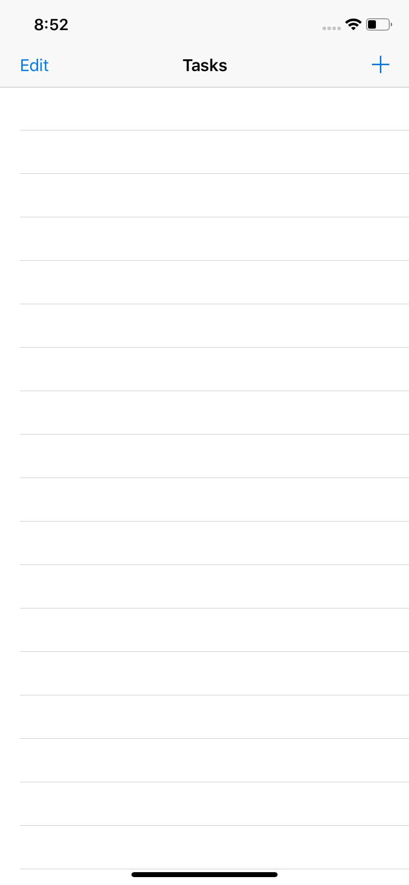
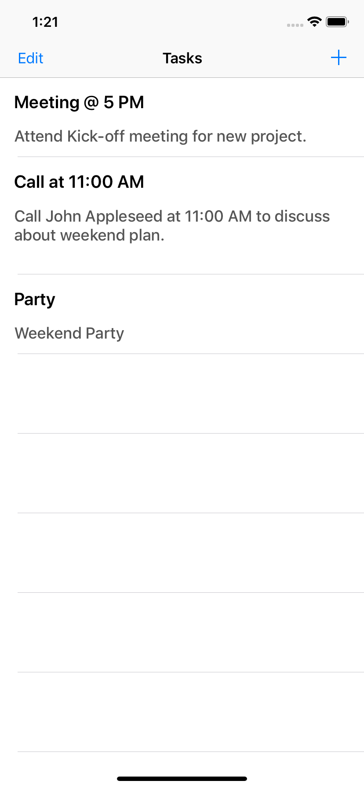
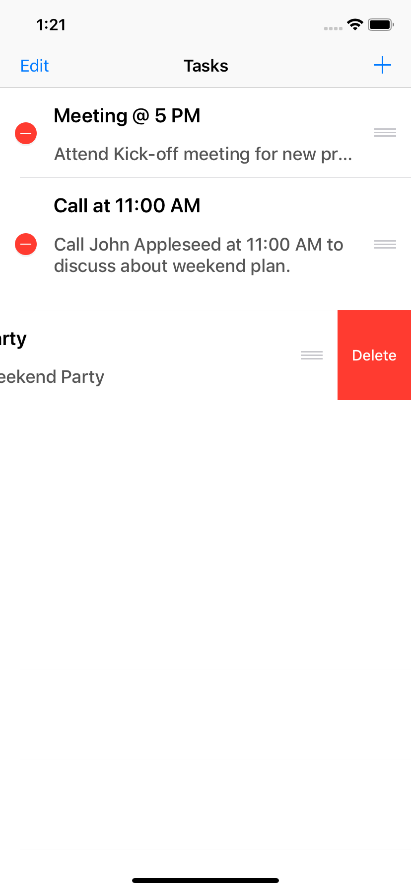
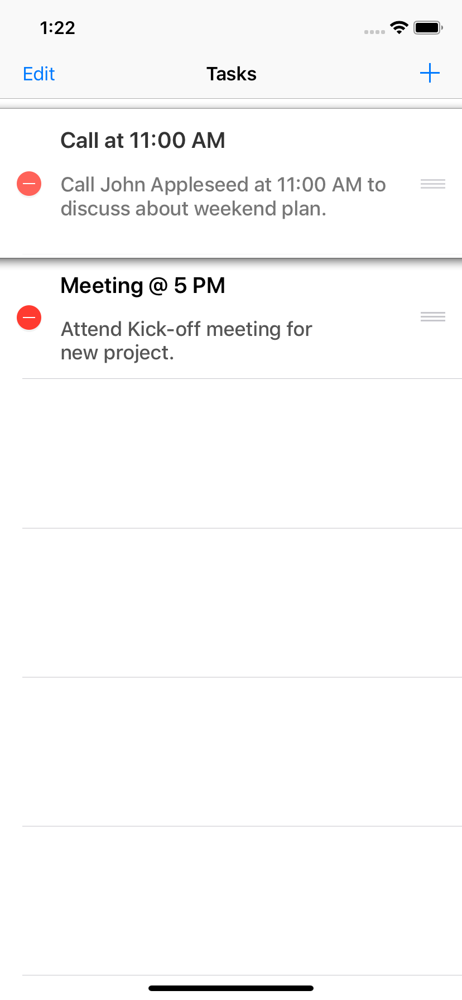

# ToDoApp

## Steps to run application.
1. **Download zip file.** 
1. **Unzip downloaded source code file.**
1. **Double click on ToDoApp.xcodeproj file.**
1. **Xcode will open :**
   1. Go to general.
   1. Change Signing certificate & Provisioning profile.
   1. Select your device and Run the project.

## Steps to use ToDo App.

1. Click on (+) icon on "Tasks" screen.

2. App navigates to "Add Your Task" screen.  Add Task Title, Task Description and click on "SaveTask" Button.

3. App saves your input and shows list on "Tasks Screen".

4. Click on "Edit" button on Top left corner. User can delete or change Task priority.

   1. Delete 

   1. Re-Order list 
