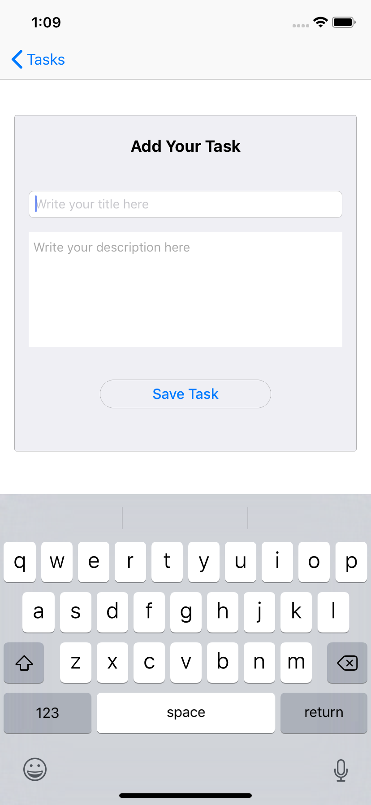

# ToDoApp
Steps to create ToDo List.

1. Click on (+) icon on "Tasks" screen.

2. App navigates to "Add Your Task" screen.  Add Task Title, Task Description and click on "SaveTask" Button.

3. App saves your input and show list on "Task Screen".

4. Click on "Edit" button on Top right corner. User can delete or change Task priority.

--> Delete 

--> Re-Order list 
